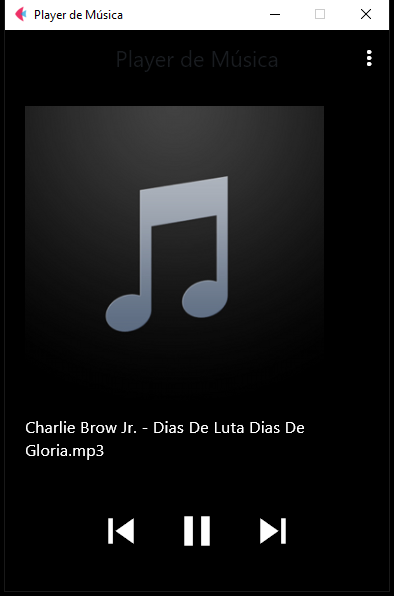

<h1 align="center">🎵 Player de Música com Flet e Pygame</h1>

Este projeto é um aplicativo de player de música desenvolvido em Python utilizando a biblioteca <a href="https://flet.dev/">Flet</a> para a interface gráfica e o <a href="https://www.pygame.org/docs/">Pygame</a> para reprodução de áudio.

<h2 align="center">🚀 Funcionalidades</h2>

<ul>
    <li>Reproduz arquivos <code>.mp3</code> de uma pasta selecionada</li>
    <li>Interface moderna com botões de controle</li>
    <li>Exibição da capa do álbum (se disponível nos metadados)</li>
    <li>Pausar, continuar e trocar de música</li>
    <li>AppBar com botão de menu (estrutura para configurações futuras)</li>
    <li>Organização modular do projeto</li>
</ul>

<h2 align="center">🖼️ Interface</h2>



<h2 align="center">🛠️ Tecnologias utilizadas</h2>

<ul>
    <li>Python 3.10+</li>
    <li><a href="https://flet.dev">Flet</a></li>
    <li><a href="https://www.pygame.org/">Pygame</a></li>
    <li><a href="https://mutagen.readthedocs.io/">Mutagen</a> (leitura de metadados)</li>
</ul>

<h2 align="center">📁 Estrutura de Pastas</h2>

<pre>
📦 player-musica
└── src
    ├── app.py # Arquivo principal
    ├── config.py # Configurações gerais
    ├── ui/
    │ └── musicPlayerUI.py # Interface gráfica (UI)
    ├── player/
    │ └── player.py # Classe Player com Pygame
    ├── utils/
    │ └── diretory.py # Buscar músicas na pasta
    ├── metadados/
    │ └── metadadosMusic.py # Capa do álbum
    ├── assets/
    │ └── default_album.png # Imagem padrão
    └── requirements.txt # Dependências
</pre>

<h2 align="center">⚙️ Instalação</h2>

```bash
# Clone o repositório
git clone https://github.com/Allison-Bitteti/player-musica.git

# Entre na pasta
cd player-musica

# Crie um ambiente virtual (opcional)
python -m venv venv
source venv/bin/activate  # ou venv\Scripts\activate no Windows

# Instale as dependências
pip install -r requirements.txt

# Execute
python app.py
